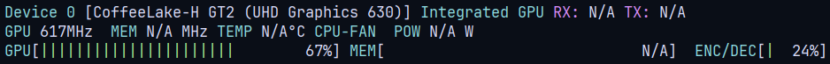

<div align="center">

# Smart Video Wallpaper Reborn

[](https://aur.archlinux.org/packages/plasma6-wallpapers-smart-video-wallpaper-reborn)
[&color=1f425f&labelColor=2d333b&logo=kde&label=KDE%20Store)](https://store.kde.org/p/2139746)
[](https://matrix.to/#/#kde-plasma-smart-video-wallpaper-reborn:matrix.org)

Plasma 6 Wallpaper plugin to play videos on your Desktop/Lock Screen

<https://github.com/luisbocanegra/plasma-smart-video-wallpaper-reborn/assets/15076387/45f32fde-a1b4-406f-8aeb-221bb071a6b9>

</div>

> [!IMPORTANT]
> **Translations are currently not loading, see [issue #84](https://github.com/luisbocanegra/plasma-smart-video-wallpaper-reborn/issues/84) if you want to help.**

## Features

- Play a single video or slideshow of videos
- Enable/disable video sound
- Lock screen support
- Playback: speed, volume control, custom and random order
- Cross-fade transition between videos (**Beta**)
- Pause Video conditions
  - Maximized or fullscreen window
  - Active window
  - Window is present
  - Never
  - Based on active Desktop Effect (e.g overview, show desktop)
  - Screen is Off/Locked
- Blur
  - Conditions
    - Maximized or fullscreen window
    - Active window
    - Window is present
    - Video is paused
    - Always
    - Never
    - Based on active Desktop Effect (e.g overview, show desktop)
  - Radius
  - Animation duration
- Battery mode (threshold)
  - Pauses video
  - Disables Blur

## Installing

### Arch Linux

[aur/plasma6-wallpapers-smart-video-wallpaper-reborn](https://aur.archlinux.org/packages/plasma6-wallpapers-smart-video-wallpaper-reborn) use your preferred AUR helper (e.g `yay -S plasma6-wallpapers-smart-video-wallpaper-reborn`)

### KDE Store

Install these dependencies or the equivalents for your distribution, **they are required for video playback**

  ```txt
  qt6-multimedia qt6-multimedia-ffmpeg
  ```

**On some distributions qt6-multimedia-ffmpeg is included with qt6-multimedia**

Install the plugin from the KDE Store [Plasma 6 version](https://store.kde.org/p/2139746)

1. Right click on the Desktop > **Desktop and Wallpaper** > **Get New Plugins**
2. **Search** for "**Smart Video Wallpaper Reborn**", install and configure.

### Manually from source

Install these dependencies or the equivalents for your distribution

```txt
git gcc cmake extra-cmake-modules libplasma qt6-multimedia qt6-multimedia-ffmpeg
```

Clone and install

```sh
git clone https://github.com/luisbocanegra/plasma-smart-video-wallpaper-reborn
cd plasma-smart-video-wallpaper-reborn
./install.sh
```

## Usage

### As Desktop Wallpaper

1. Right click on the Desktop > **Desktop and Wallpaper**
2. Change **Wallpaper type** to "Smart Video Wallpaper Reborn"
3. Add your videos
4. Apply

### As Lock Screen wallpaper

1. Go to **System settings** > **Screen Locking** > **Configure Appearance...**
2. Change **Wallpaper type** to "Smart Video Wallpaper Reborn"
3. Add your videos
4. **IMPORTANT:** Enable **Lock screen mode** in **Playback** tab
5. Apply

## This plugin requires correctly setup Media codecs

- [Arch Linux (ArchWiki - Codecs and containers - Video codecs)](https://wiki.archlinux.org/title/Codecs_and_containers#Video_codecs)
- [Fedora (RPM Fusion repo)](https://rpmfusion.org/Howto/Multimedia)
- [openSUSE (Packman repositories)](https://en.opensuse.org/SDB:Installing_codecs_from_Packman_repositories)

## Improve performance by enabling Hardware Video Acceleration

> Hardware video acceleration makes it possible for the video card to decode/encode video, thus offloading the CPU and saving power.

First, verify acceleration you can install and run [nvtop](https://github.com/Syllo/nvtop), it will show a decoding usage when Hardware acceleration is working:



If `nvtop` is not available you can use:

- `intel_gpu_top` from [intel-gpu-tools](https://gitlab.freedesktop.org/drm/igt-gpu-tools) for Intel GPU (video engine)
- `nvidia-smi dmon` for Nvidia GPU (dec column)
- [amdgpu_top](https://github.com/Umio-Yasuno/amdgpu_top) for AMD GPU (dec column)

If there is no decoding usage you will have to enable video acceleration in your system

- [Arch Linux (ArchWiki - Hardware video acceleration)](https://wiki.archlinux.org/title/Hardware_video_acceleration).
- [Fedora (Fedora Project Wiki - Video decoding)](https://fedoraproject.org/wiki/Firefox_Hardware_acceleration#Video_decoding)

## Black video or Plasma crashes

There may be some issues with Qt Causing crashes on AMD GPUs, this is currently being investigated in [QTBUG-124586 - QML video media player segmentation fault on AMD GPU with FFMPEG](https://bugreports.qt.io/browse/QTBUG-124586) and [Black screen with gstreamer as Qt Media backend (Recent KDE Neon update)](https://github.com/luisbocanegra/plasma-smart-video-wallpaper-reborn/issues/8)

To recover from a crash loop remove the videos from the configuration using this command below in terminal/tty

```sh
sed -i 's/^VideoUrls=.*$/VideoUrls=/g' $HOME/.config/plasma-org.kde.plasma.desktop-appletsrc $HOME/.config/kscreenlockerrc
```

then reboot or restart plasmashell `systemctl --user restart plasma-plasmashell.service` or `plasmashell --replace` if the former doesn't work.

### Possible solution, switching to GStreamer as Qt Media backend

1. Install the media codecs and qt6-multimedia and gstreamer packages if you don't have them:

    **openSUSE**

    ```sh
    sudo zypper install opi
    opi codecs
    sudo zypper install qt6-multimedia gstreamer-plugins-libav
    ```

    **Arch**

    ```sh
    sudo pacman -S qt6-multimedia qt6-multimedia-gstreamer gst-libav --needed
    ```

    If you need extra codecs see <https://wiki.archlinux.org/title/GStreamer>

    **PRs to expand this list are welcome :)**

2. Switch the Qt Media backend to `gstreamer` (default is `ffmpeg`):

    Create the file `~/.config/plasma-workspace/env/qt-media-backend.sh`

    ```sh
    #!/bin/bash
    export QT_MEDIA_BACKEND=gstreamer
    ```

3. **Reboot** to apply the changes, and verify it was correctly set by running `echo $QT_MEDIA_BACKEND`

**Video still doesn't play/keeps crashing?** Follow these steps

1. Run `journalctl -f > journal.txt` and `sudo dmesg -wHT > dmesg.txt` in separate terminals
2. While both commands are running switch from the Image wallpaper plugin to video wallpaper and reproduce the issue
3. Then stop both commands
4. If needed, remove the plugin configuration (`sed` command above)
5. Get your system information from `kinfo > sysinfo.txt` command or from **System settings** > **About this System**
6. Save the file from [here](https://gist.github.com/luisbocanegra/cb758ee5f57a9e7c2838b1db349b635a) as **test.qml**. Run the test qml with from terminal `QT_FFMPEG_DEBUG=1 QSG_INFO=1 QT_LOGGING_RULES="*.debug=true" qml6 test.qml 2> qml_video_test_log.txt`, (qml6 may be qml-qt6 or /usr/lib/qt6/bin/qml please confirm is qt6 one with --version) this file will play some public test videos from internet in fullscreen. If it doesn't crash immediately, try clicking the pause/next buttons a bunch of times.
7. Run `lspci -k | grep -EA3 'VGA|3D|Display' > lspci.txt`
8. Create a new [new issue](https://github.com/luisbocanegra/plasma-smart-video-wallpaper-reborn/issues/new) describing the problem and how to reproduce, and attach those files including wether running the **test.qml** also crashes or not.

## Support the development

- If you like the project please consider donating/sponsoring this and [my other open source work](https://github.com/luisbocanegra?tab=repositories&q=&type=source&language=&sort=stargazers)

  [](https://github.com/sponsors/luisbocanegra) [](https://ko-fi.com/luisbocanegra) [](https://www.buymeacoffee.com/luisbocanegra) [](https://liberapay.com/luisbocanegra/) [](https://www.paypal.com/donate/?hosted_button_id=Y5TMH3Z4YZRDA)

- [Give it a star on GitHub](https://github.com/luisbocanegra/plasma-smart-video-wallpaper-reborn)
- Rate / leave review in the [KDE Store](https://store.kde.org/p/2139746)

## Acknowledgements

- This project a rewrite based on [adhec/Smart Video Wallpaper](https://github.com/adhec/plasma_tweaks/tree/master/SmartVideoWallpaper) and [PeterTucker/smartER-video-wallpaper](https://github.com/PeterTucker/smartER-video-wallpaper) projects.
- [Zren's kpac](https://github.com/Zren/plasma-applet-lib) to manage translations
