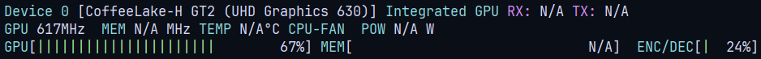

<div align="center">

<p align="center"></p>

# Smart Video Wallpaper Reborn

[](https://aur.archlinux.org/packages/plasma6-wallpapers-smart-video-wallpaper-reborn)
[&labelColor=2d333b&logo=kde&label=KDE%20Store&style=for-the-badge&color=1378AD)](https://store.kde.org/p/2139746)
[&logo=fedora&label=Fedora%2043&labelColor=2d333b&style=for-the-badge&color=1378AD)](https://software.opensuse.org//download.html?project=home%3Aluisbocanegra&package=plasma-smart-video-wallpaper-reborn)
[&logo=fedora&label=Fedora%20Rawhide&labelColor=2d333b&style=for-the-badge&color=1378AD)](https://software.opensuse.org//download.html?project=home%3Aluisbocanegra&package=plasma-smart-video-wallpaper-reborn)
[&logo=opensuse&label=openSUSE%20Tumbleweed&labelColor=2d333b&style=for-the-badge&color=13ad28)](https://software.opensuse.org//download.html?project=home%3Aluisbocanegra&package=plasma-smart-video-wallpaper-reborn)
[&logo=opensuse&label=openSUSE%20Slowroll&labelColor=2d333b&style=for-the-badge&color=13ad28)](https://software.opensuse.org//download.html?project=home%3Aluisbocanegra&package=plasma-smart-video-wallpaper-reborn)

Plasma 6 Wallpaper plugin to play videos on your Desktop/Lock Screen

<https://github.com/luisbocanegra/plasma-smart-video-wallpaper-reborn/assets/15076387/45f32fde-a1b4-406f-8aeb-221bb071a6b9>

</div>

If you enjoy using the plugin consider sponsoring or donating to support the maintenance of this and [my other projects](https://github.com/luisbocanegra?tab=repositories&q=&type=source&language=&sort=stargazers).

[](https://github.com/sponsors/luisbocanegra)
[](https://ko-fi.com/luisbocanegra)
[](https://www.buymeacoffee.com/luisbocanegra)
[](https://www.paypal.com/donate/?hosted_button_id=Y5TMH3Z4YZRDA)
[](https://patreon.com/luisbocanegra?utm_medium=unknown&utm_source=join_link&utm_campaign=creatorshare_creator&utm_content=copyLink)

## Join our Discord / Matrix

Help/Support/Discussion about my projects

[](https://discord.gg/ZqD75dzKTe)
[](https://matrix.to/#/#kde-plasma-smart-video-wallpaper-reborn:matrix.org)

## Features

<details>
<summary>Expand</summary>

- Play a single video or slideshow of videos
- Enable/disable video sound
- Lock screen support
- Playback
  - Speed
  - Alternative speed
  - Volume control
  - Random order
  - Timer
  - Resume last video on startup
- Cross-fade transition between videos (**Beta**)
- Pause Video conditions
  - Maximized or fullscreen window
  - Active window
  - Window is present
  - Never
  - Based on active Desktop Effect (e.g overview, show desktop)
  - Screen is Off/Locked
- Blur
  - Conditions
    - Maximized or fullscreen window
    - Active window
    - Window is present
    - Video is paused
    - Always
    - Never
    - Based on active Desktop Effect (e.g overview, show desktop)
  - Radius
  - Animation duration
- Blur background when playing videos in their original proportions
- Battery mode (threshold)
  - Pauses video
  - Disables Blur
- Per monitor windows detection
- Day-night switch, assign videos based on different conditions
  - Plasma style (day, night)
  - Plasma's Day-Night cycle (sunrise, sunset, day, night) requires [building from source](#manually-from-source)
  - Custom times (sunrise, sunset, day, night)

</details>

## Installing

### Arch Linux

```sh
yay -S plasma6-wallpapers-smart-video-wallpaper-reborn
```

Or your preferred AUR helper

> Maintained by me at <https://aur.archlinux.org/packages/plasma6-wallpapers-smart-video-wallpaper-reborn>

### openSUSE Build Service packages (Fedora, openSUSE)

Install instructions: <https://software.opensuse.org//download.html?project=home%3Aluisbocanegra&package=plasma-smart-video-wallpaper-reborn>

> Maintained with @pallaswept and me at <https://build.opensuse.org/package/show/home:luisbocanegra/plasma-smart-video-wallpaper-reborn>

### Fedora

Use dnf to install plasma-smart-video-wallpaper-reborn: `sudo dnf in plasma-smart-video-wallpaper-reborn`. The package will, by default, install ffmpeg-free if it isn't installed which should work for most videos. In case of issues, follow the instructions to install additional codecs from RPMfusion.

> **This package is not maintained by me and may not be up-to-date with the latest release**.

### KDE Store

1. First, install these dependencies or the equivalents for your distribution, depending on the distribution or how you configured your system these may already be installed. **They are required for video playback**.

   - Arch Linux

     ```sh
     sudo pacman -S qt6-multimedia qt6-multimedia-ffmpeg --needed
     ```

   - Fedora

     ```sh
     sudo dnf install qt6-multimedia
     ```

   - Debian

     ```sh
     sudo apt install libqt6multimedia6 qml6-module-qtmultimedia
     ```

    > On some distributions qt6-multimedia-ffmpeg is included with qt6-multimedia

2. Right click on the Desktop > **Desktop and Wallpaper** > **Get New Plugins**
3. **Search** for "[**Smart Video Wallpaper Reborn**](https://store.kde.org/p/2139746)" by [luis-bocanegra](https://www.opendesktop.org/u/luis-bocanegra/) and install it.

### Manually from source

Install these dependencies or the equivalents for your distribution

```txt
git gcc cmake extra-cmake-modules libplasma qt6-multimedia qt6-multimedia-ffmpeg
```

Clone and install

```sh
git clone https://github.com/luisbocanegra/plasma-smart-video-wallpaper-reborn
cd plasma-smart-video-wallpaper-reborn
./install.sh
```

## Usage

### As Desktop wallpaper

1. Right click on the Desktop > **Desktop and Wallpaper**
2. Change **Wallpaper type** to "Smart Video Wallpaper Reborn"
3. Add your videos
4. Apply

### As Lock Screen wallpaper

1. Go to **System settings** > **Screen Locking** > **Configure Appearance...**
2. Change **Wallpaper type** to "Smart Video Wallpaper Reborn"
3. Add your videos
4. Apply

### As Login Screen wallpaper

> [!NOTE]
> This requires that either you or you distribution have switched from SDDM to Plasma Login Manager. You can check if that's the case by running `systemctl is-enabled plasmalogin`, it should return `enabled`.
>
> If it returns `disabled` or `not-found` search for how to do this in your distribution documentation, [instructions for Arch](https://wiki.archlinux.org/title/Plasma_Login_Manager), [instructions for Fedora](https://discussion.fedoraproject.org/t/replace-sddm-with-plasma-login-manager-after-the-upgrade/190632).
>
> **You also need administrator (root) privileges to be able to do this**

1. Edit `/etc/plasmalogin.conf` (create it if it does not exist) as follows:

    ```ini
    [Greeter]
    WallpaperPluginId=luisbocanegra.smart.video.wallpaper.reborn
    ```

    Save the changes

2. Your video files need to be in a directory that allows other users to see them, which includes the `plasmalogin` user, you can create one like this:

    ```sh
    sudo mkdir /srv/shared
    sudo chmod 777 /srv/shared
    ```

    Copy your videos to that directory and make sure they are readable by other users, running `ls -l /srv/shared` should show the video files permission as `-rw-r--r--`. In most distributions that will be the case by default, if not, run `find /srv/shared -type f -exec chmod 644 {} +`.

    The directory `/srv/shared` is just a suggestion, you can use other location as long as the files are readable by the `plasmalogin` user:

    ```sh
    find /srv/shared -type f -exec sudo -u plasmalogin test -r {} \;
    ```

3. Go to System Settings > Login Screen > Configure Appearance and add your videos from `/srv/shared` then apply the changes.

## This plugin requires correctly setup Media codecs

To be able to play most video files, you may need to install additional packages from your distribution

- [Arch Linux (ArchWiki - Codecs and containers - Video codecs)](https://wiki.archlinux.org/title/Codecs_and_containers#Video_codecs)
- [Fedora (RPM Fusion repo)](https://rpmfusion.org/Howto/Multimedia)
- [openSUSE (Packman repositories)](https://en.opensuse.org/SDB:Installing_codecs_from_Packman_repositories)
- [Gentoo (Gentoo Wiki - Media container formats)](https://wiki.gentoo.org/wiki/Multimedia_container_formats)

## Improve performance by enabling Hardware Video Acceleration
>
> [!TIP]
> Hardware video acceleration makes it possible for the video card to decode/encode video, thus offloading the CPU and saving power.

First, verify acceleration you can install and run [nvtop](https://github.com/Syllo/nvtop), it will show a decoding usage when Hardware acceleration is working:



If `nvtop` is not available you can use:

- `intel_gpu_top` from [intel-gpu-tools](https://gitlab.freedesktop.org/drm/igt-gpu-tools) for Intel GPU using the `i915` driver (video engine)
- `gputop` for Intel GPU using the `xe` driver (video column)
- `nvidia-smi dmon` for Nvidia GPU (dec column)
- [`amdgpu_top --smi`](https://github.com/Umio-Yasuno/amdgpu_top) for AMD GPU (dec column)

If there is no decoding usage you will have to enable video acceleration in your system

- [Arch Linux (ArchWiki - Hardware video acceleration)](https://wiki.archlinux.org/title/Hardware_video_acceleration)
- [Fedora (Fedora Project Wiki - Video decoding)](https://fedoraproject.org/wiki/Firefox_Hardware_acceleration#Video_decoding)
- [Debian (Debian Wiki - HardwareVideoAcceleration)](https://wiki.debian.org/HardwareVideoAcceleration)
- [Gentoo (Gentoo Wiki - VA-API)](https://wiki.gentoo.org/wiki/VAAPI)

## Change which GPU is used for video decoding

Depending on your configuration, the GPU doing the hardware decoding may not be the one you want.

Go to the wallpaper plugin configuration > Advanced tab and set one of the following options according to your hardware:

Intel only or paired with another vendor GPU

- FFmpeg + VA-API acceleration backend + iHD VA-API driver
- FFmpeg + Quick Sync acceleration backend
- FFmpeg + Vulkan acceleration backend if Intel is the primary renderer or the other GPU does not support it

AMD only or paired with another vendor GPU

- FFmpeg + VA-API acceleration backend + radeonsi VA-API driver
- FFmpeg + Vulkan acceleration backend if AMD is the primary renderer or the other GPU does not support it

NVIDIA only or paired with another vendor GPU

- FFmpeg + cuda acceleration backend
- FFmpeg + Vulkan acceleration backend if NVIDIA is the primary renderer or the other GPU does not support it

> [!NOTE]
> For VA-API to be forced on a specific GPU vendor, their kernel module must be loaded first, see [#142-issuecomment-5729323309](https://github.com/luisbocanegra/plasma-smart-video-wallpaper-reborn/issues/142#issuecomment-5729323309)
>
> When using the Vulkan acceleration backend, if all GPUs support it, the one rendering your desktop will be used for video decoding, you can see which one it is running `dbus-send --print-reply --session --dest=org.kde.KWin --type=method_call /KWin org.kde.KWin.supportInformation | grep -i renderer`

> [!IMPORTANT]
> These settings only apply to the Desktop and Lock screen, for them to also work on the Login Screen copy `$HOME/.config/plasma-workspace/env/luisbocanegra.smart.video.wallpaper.reborn.sh` to `/etc/profile.d/` or copy its contents to `/etc/environment`

## Common issues and solutions

### Recover from crashes

In case of crash loop switch to a TTY (Ctr + Alt + one of your F1-F12 keys) and remove the videos from the Desktop, Lock Screen and Login Screen configuration using the following command:

  ```sh
  sudo sed -i 's/^VideoUrls=.*$/VideoUrls=/g' $HOME/.config/plasma-org.kde.plasma.desktop-appletsrc $HOME/.config/kscreenlockerrc /etc/plasmalogin.conf
  ```

Then reboot your system.

### Videos not playing or rendering issues

Try disabling hardware textures conversion

  1. Open the wallpaper settings
  2. Go to the Advanced tab
  3. **Enable** the option **Disable hardware textures conversion**
  4. Log out and back in

Switch to GStreamer as Qt Media backend

  1. Install the media codecs and qt6-multimedia and gstreamer packages if you don't have them:

      **openSUSE**

      ```sh
      sudo zypper install opi
      opi codecs
      sudo zypper install qt6-multimedia gstreamer-plugins-libav
      ```

      **Arch**

      ```sh
      sudo pacman -S qt6-multimedia qt6-multimedia-gstreamer gst-libav --needed
      ```

      If you need extra codecs see <https://wiki.archlinux.org/title/GStreamer>

      > **PRs to expand this list are welcome :)**

  2. Open the wallpaper settings
  3. Go to the Advanced tab and change **Media backend** to GStreamer
  4. Log out and back in to apply the changes

### Video still doesn't play/keeps crashing

1. Run `journalctl -f > journal.txt` and `sudo dmesg -wHT > dmesg.txt` in separate terminals
2. While both commands are running switch from the Image wallpaper plugin to video wallpaper and reproduce the issue
3. Then stop both commands
4. If needed, remove the plugin configuration (see removal instructions above)
5. Get your system information from `kinfo` command or from **System settings** > **About this System**
6. Save the file from [here](https://gist.github.com/luisbocanegra/cb758ee5f57a9e7c2838b1db349b635a) as **test.qml**. Run the test qml with from terminal:

    ```sh
    QT_MESSAGE_PATTERN="%{if-debug}[D] %{endif}%{if-info}[I] %{endif}%{if-warning}[W] %{endif}%{if-critical}[E] %{endif}%{if-fatal}[F] %{endif}%{time [hh:mm:ss.zzz]}: %{appname}: %{if-category}%{category}:%{endif} %{file}:%{line}:%{function}: %{message}" QT_FFMPEG_DEBUG=1 QSG_INFO=1 QT_DEBUG_PLUGINS=1 QT_LOGGING_RULES="qml.debug=true;*.ffmpeg.*=true;*.multimedia.*=true" qml test.qml 2> qml_video_test_log.txt
    ```

    `qml` executable may be `qml6`, `qml-qt6` or `/usr/lib/qt6/bin/qml` please confirm is Qt 6 one with `--version`

    The test file play some public test videos from internet. If it doesn't fail immediately, try clicking the pause/next buttons a bunch of times.

7. Run `lspci -k | grep -EA3 'VGA|3D|Display' > lspci.txt`
8. Create a new [new issue](https://github.com/luisbocanegra/plasma-smart-video-wallpaper-reborn/issues/new) describing the problem and how to reproduce, provide the requested information and the `qml_video_test_log.txt`, `journal.txt`, `dmesg.txt` files

### Contributing Translations

See [Translations](https://github.com/luisbocanegra/plasma-smart-video-wallpaper-reborn/blob/main/translate/README.md)

## Acknowledgements

- This project a rewrite based on [adhec/Smart Video Wallpaper](https://github.com/adhec/plasma_tweaks/tree/master/SmartVideoWallpaper) and [PeterTucker/smartER-video-wallpaper](https://github.com/PeterTucker/smartER-video-wallpaper) projects.
- [ccatterina's script](https://github.com/ccatterina) to manage translations
- Brand icons from [Simple Icons](https://simpleicons.org)
- Day-night icons from [Google LLC. / Pictogrammers](https://pictogrammers.com/library/mdi/)
